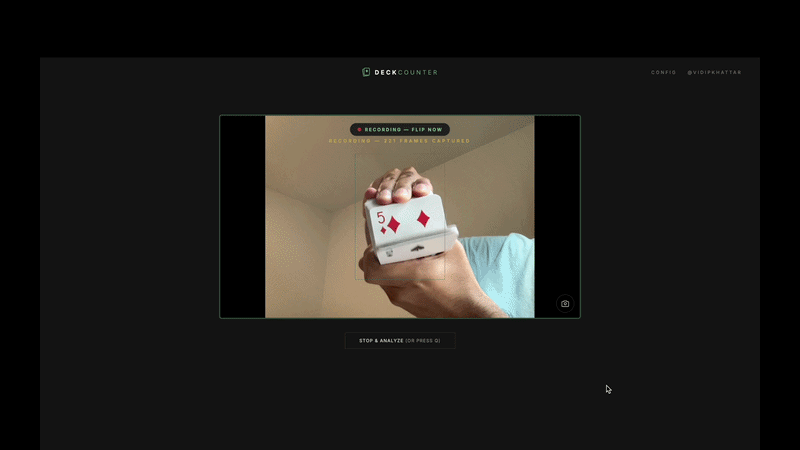

# DeckCounter

*The deck audit tool nobody at the poker table asked for, but everybody secretly needed.*



*(Flip through a deck in front of the camera, get a seen/missing report back in seconds.*

**[Live demo →](https://cardcountercv-production.up.railway.app/)**

## The origin story

Back in uni, poker nights often ran long: six, seven hours deep, blinds climbing, everyone slowly losing the ability to count to 52. And somewhere around hour four, a card would go missing. Slid under the table, stuck to someone's sleeve (deliberately or otherwise), or just gone.

A missing 7 is annoying. A missing Ace is telling — it secretly flips the odds for the rest of the night and nobody at the table would ever know. Manually counting a shuffled deck card-by-card at 3am, mid-game, with a table full of impatient degenerates, is nobody's idea of fun. And it's *exactly* the kind of tedious, error-prone task a camera and a model are better at than tired human eyes.

So: hold the deck up to your laptop, flick through it like you're riffling for a shuffle, and let the camera do the counting.

## What it actually does

1. **Show it a card.** Point your webcam at the deck — a guide box appears on screen, and the moment it sees a card in there, recording kicks off automatically. No button mashing.
2. **Flip through the deck.** Fast, slow, whatever — flick through once or a couple of times if you're paranoid. Every frame gets buffered while you flip so there's zero lag.
3. **Press Q.** It chews through every frame it captured, cross-checking detections across multiple frames (so one blurry frame doesn't cost you a card), and spits out a clean report:

```
Seen (50): AS, 2S, 3S, 4S, 5S, 6S, 7S, 8S, 9S, 10S, JS, QS, KS, ...
Missing (2): 4S, 9D
```

Now you know exactly what to go dig out from under the couch cushions before dealing the next hand.

## Running it

```bash
python3 -m venv venv && source venv/bin/activate
pip install -r requirements.txt
python3 src/main.py
```

### Tuning it (optional)

If the deck's giving you trouble (bad lighting, fast hands, whatever), these flags are there to help:

| Flag | What it does | Default |
|---|---|---|
| `--camera` | Which camera index to use | `0` |
| `--confidence` | How sure the model needs to be per-frame for a detection to count | `0.35` |
| `--min-consensus` | How many separate frames a card needs to show up in before it counts as "seen" | `1` |
| `--presence-confidence` | How sure it needs to be that *something* is in the guide box before auto-starting | `0.25` |
| `--playback-delay` | Milliseconds to pause on each frame while it's processing, so you can actually watch it think | `15` |

Slower, deliberate flips beat fast ones — motion blur is the real enemy here, not the model.

## Web UI

Same detection pipeline, browser-based front end instead of the OpenCV window — a dark, minimal dashboard with a live camera feed, an auto-starting guide box, and results laid out as a detected-inventory grid, a missing-components panel, and a metrics sidebar (accuracy, sample count, latency).

```bash
source venv/bin/activate
uvicorn src.web.server:app
```

Then open `http://localhost:8000`. Your browser will ask for camera permission (it captures via `getUserMedia` and streams frames to the server over a WebSocket — the server itself never touches camera hardware, which is what makes it deployable). Same flow as the CLI otherwise — place a card in the box to auto-start, flip through the deck, then either click **Stop & Analyze** or press **Q** to trigger processing. **Refresh Dataset** resets the session for another run.

## Under the hood

- **OpenCV** for frame decoding and box-drawing
- A pretrained **YOLOv11** playing-card detector ([`sroot/yolo11s-playing-cards-detector`](https://huggingface.co/sroot/yolo11s-playing-cards-detector) off Hugging Face) — no training pipeline of our own to babysit
- A two-phase capture-then-process design: buffer frames raw while you flip (so the camera never lags behind your hands), then batch-analyze everything afterward with multi-frame consensus voting to smooth out blur-induced misreads
- Detection logic lives in `src/detector.py`, shared by both the CLI (`src/main.py`) and the web server (`src/web/server.py`)
- In the web version, the **browser** owns the camera (`getUserMedia`) and streams JPEG frames up over a WebSocket for the server to run detection on — the server never touches camera hardware directly, which is what makes it deployable to a host that isn't your own laptop

## Process & technical decisions

**Pretrained over from-scratch.** The first version of this repo trained a custom Keras classifier on a hand-labeled dataset of card photos. It underperformed a pretrained YOLOv8/11 model already fine-tuned on a public Roboflow playing-card dataset — for a well-defined, already-solved 52-class problem, the right call was finding a model that had already learned it, not re-deriving it. That earlier training pipeline was deleted entirely in favor of `sroot/yolo11s-playing-cards-detector` off the Hugging Face Hub.

**Recall was the real bottleneck, not accuracy.** Early on, running detection live on every frame missed most cards during a fast flip-through — a card only visible for one or two motion-blurred frames just doesn't clear a confidence threshold reliably. The fix was architectural, not a bigger model: **decouple capture from inference**. Buffer raw frames with zero processing while flipping (so hand speed is never CPU-bound), then batch-process everything afterward with **multi-frame consensus voting** — a card only counts once it clears the confidence threshold in multiple separate frames, which tolerates single-frame misses without letting one blurry frame cost a card. That single change took real-world recall from roughly 20/52 to consistently 50/52 in testing.


No cheaters were caught in the making of this tool.